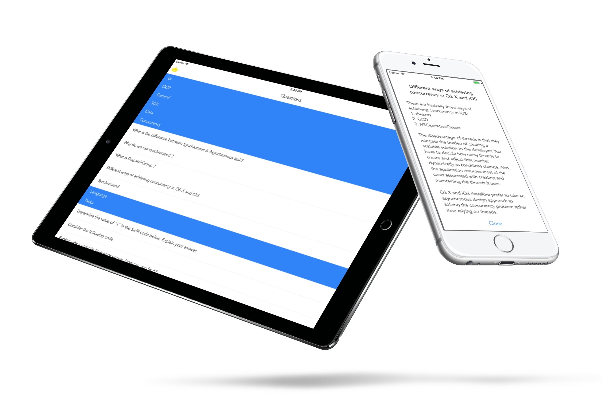

## Question's localization
Guide for interviewers and interviewees. Review these iOS interview questions - and get some practical tips along the way.
A small guide to help those looking to hire a iOS developer for work.

🔛 Select language for questions and get started!  

## Install the app  
It's more convenient to have a nice mobile solution to prepare for the iOS-Developer interview on the go. Never miss a tricky question. You can find free app on the App Store: 

📲 http://appstore.com/awesomeinterview  

## Star to save QA
Feature to save favorite questions is added. More about new app features here:
🌟 http://dashvlas.com/portfolio/ai

## Available question types

## Contribute
⏰ App is updated once a week.

💻 Feel free to add your questions and tasks to database.

🚀 Just fork the project and pull request.
