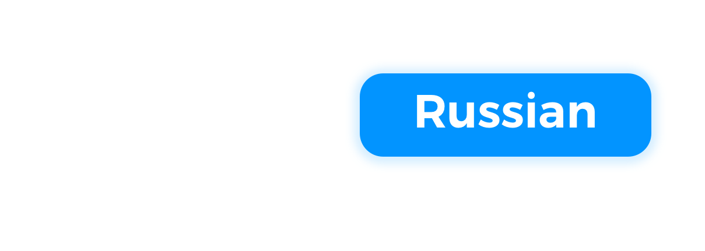
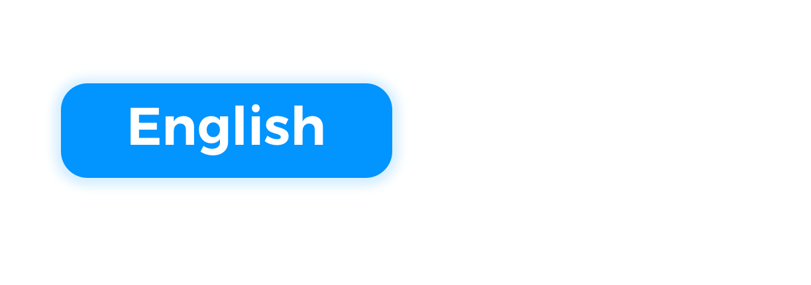

## Awesome iOS interview questions and answers
🔛 Get started by picking interview's language and start preparing right now  

## Install the app  
Prepare for the iOS-Developer interview on the go. Never miss a tricky question.  
You can find free app on the App Store: 

📲 http://appstore.com/awesomeinterview  

## Questions categories  

## About
Review these iOS interview questions - and get some practical tips along the way.  
A handy guide to help those looking to hire an iOS developer for work.  

## Contribution
⏰ We are trying to update app with questions ASAP.  

   But if you'd like to participate in app production just email me.  
   dariakorneichuk@icloud.com  
   
💻 Feel free to add your questions and tasks to database.  
🚀 Just fork the project and pull request. 
